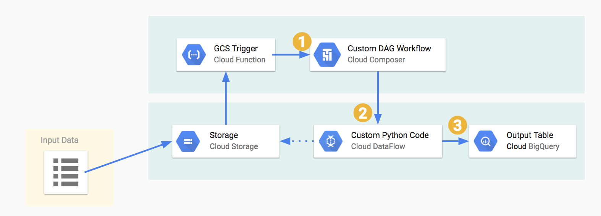
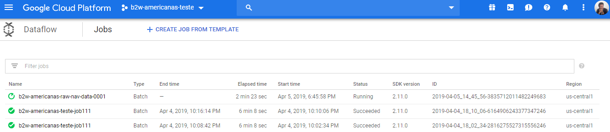
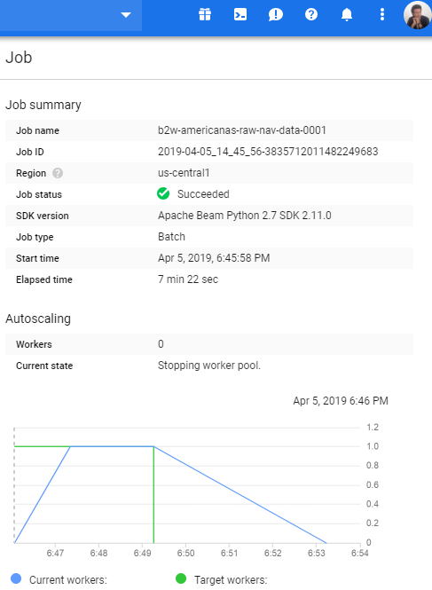
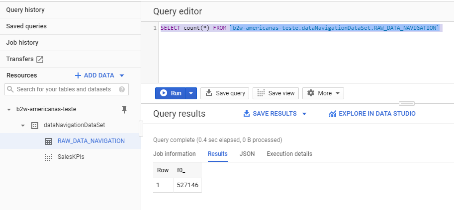
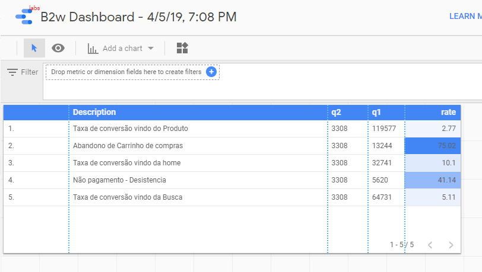
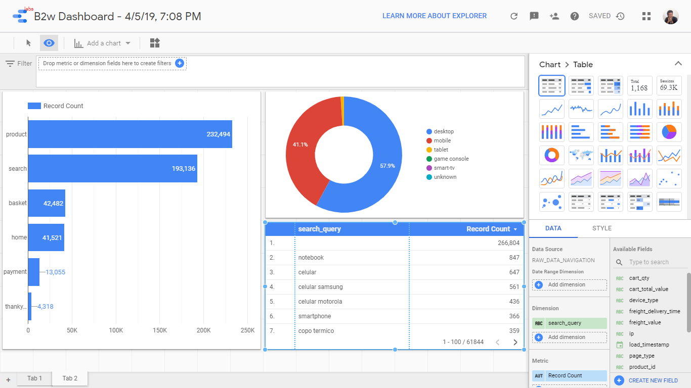

# Solução simples de importação e geração indicadores de grande volumes de dados no Google Cloud
### Repositório criado com objetivo de compartilhar solução desde as motivações da arquitetura até a implementação. 
#### Motivação: Cliente possui site que a cada 1 minuto gera um arquivo de log no formato CSV de 400 MB. 
Esse arquivo possui todo ciclo de navegação de cada cliente desde o acesso inicial ao site até o pagamento. 
#### Desafio: Desenhar solução escalável que leia esses arquivos e que se consiga extrair informações relevantes para o clientes, como: 
KPIs importantes como taxa de conversão, taxa de abandono de carrinho de compras entre outros. 


### O escopo desse documento se divide nos seguintes tópicos.

1. Arquitetura Proposta
2. Motivação da Arquitetura
3. Fluxo Principal
4. Motivação Pessoal para Arquitetura
5. Implementação
6. Proposta de Evolução


### 1. Arquitetura Proposta




### 1.2 Fluxo Principal

> A arquitetura tem o seguinte fluxo principal:

1. Existem a função [index.js](index.js) no [Google Cloud Functions](https://cloud.google.com/functions/features/?hl=pt-br).
2. Que fica monitorando o bucket b2w-americanas-teste a procura por novos arquivos adicionados no [Google Storage](https://cloud.google.com/storage/?hl=pt-Br)
3. Essa função tem uma trigger que é informada quando um novo arquivo é adicionado no bucket, logo, acionando o orquestrador [simple_load_dag.py](simple_load_dag.py) no [Google Composer](https://cloud.google.com/composer/?hl=pt-br) 
4. Que executa o script python [storage-to-dataflow-to-bigquery.py](storage-to-dataflow-to-bigquery.py) no [Google DataFlow](https://cloud.google.com/dataflow/?hl=pt-br)
5. Inserindo os do CSV na tabela b2w-americanas-teste:dataNavigationDataSet.RAW_DATA_NAVIGATION do [BigQuery](https://cloud.google.com/bigquery/?hl=pt-br), movendo o CSV para o bucket b2w-americanas-teste-bucket-navi-out.   
6. Foi criada a view [SalesKPI.sql](SalesKPI.sql) no [BigQuery](https://cloud.google.com/bigquery/?hl=pt-br) com indicadores relevantes para o projeto, sendo essa view lida no nesse exemplo é um job em Python, que pega os arquivos CSVs adicionados no bucket do , transforma no formato reconhecido e adiciona na tabela do [BigQuery](https://cloud.google.com/bigquery/?hl=pt-br). 
7. Essa view é acessada pelo Google [DataStudio](https://datastudio.google.com/) gerando [relatório](datastudio2.png) e os [indicadores](datastudio.png).

### 2 Abaixo uma breve descrição de cada step na sua ordem de chamada, com seu devido marketing.
+ [Google Storage](https://cloud.google.com/storage/?hl=pt-Br), nosso storage aonde colocaremos nossos arquivos CSV para serem processados.
> Armazenamento unificado de objetos para desenvolvedores e empresas
+ [Google Cloud Functions](https://cloud.google.com/functions/features/?hl=pt-br), nossa trigger que avisa quando um novo arquivo for adicinado no bucket. 
> A maneira mais fácil de executar e escalonar o código na nuvem
+ [Google Composer](https://cloud.google.com/composer/?hl=pt-br), nosso orquestrador que fará a gestão de todo workflow.
> Um serviço de orquestração do fluxo de trabalho totalmente gerenciado criado no Apache Airflow
+ [Google DataFlow](https://cloud.google.com/dataflow/?hl=pt-br), responsável pela gestão da pipeline dos dados.
> Processamento simplificado de dados de stream e em lote, com a mesma confiabilidade e expressividade
+ [BigQuery](https://cloud.google.com/bigquery/?hl=pt-br), nosso banco de dados.
> Um armazenamento de dados na nuvem rápido, altamente dimensionável, econômico e totalmente gerenciado para análise com machine learning.
+ [DataStudio](https://datastudio.google.com/), nossa ferramenta para criação de relatórios. 
> Desbloqueie o poder de seus dados com painéis interativos e relatórios bonitos que inspiram decisões de negócios mais inteligentes.

### 3 Motivação da Proposta
Para essa essa arquitetura priorizamos não obrigar instalar nenhuma biblioteca ou ferramenta localmente, tudo será instalado na núvem.  
Cobre requisitos do cliente e outros como escalabilidade sob demanda, modelo de programação simplificado e opensource, controle de custo, gerenciamento automático de recursos, que conforme a google diz:
> "Recursos praticamente ilimitados".

### 3.1 Motivação Pessoal para Arquitetura

##### 3.1.1 Porque desenhar toda solução na núvem e não localmente ?
Como meu computador não é muito, experimentar qualquer solução localmente seria lastimável. 
##### 3.1.2 Porque utilizando o Google Cloud ?
Escolhi o google por já ter bastante contato toda solução Cloud do [Firebase](https://firebase.google.com) para um projeto pessoal com IONIC. Também porque eu ganhei um voucher por 6 meses para utilizar todos o serviços do Google Cloud gratuitamente.
##### 3.1.3 Porque utilizar Python e não Java ?
Porque Java eu já tenho bastante experiência e Python para esse tipo de projeto eu teria um código mais limpo.
##### 3.1.4 Porque utilizar Google DataStudio ?
Utilizei aqui para simplificar o nosso exemplo, o customização dos relatórios é muito limitada, indicaria soluções como Tableau, SAP BO, SAS entre outros, dependeria do orçamento.

### 4. Execução da pipeline

1.1.
Para essa essa arquitetura priorizamos não obrigar instalar nenhuma biblioteca ou ferramenta localmente, tudo será instalado na núvem.  
Cobre requisitos do cliente e outros como escalabilidade sob demanda, modelo de programação simplificado e opensource, controle de custo, gerenciamento automático de recursos, que conforme a google diz:
> "Recursos praticamente ilimitados".

### 7. Implementação

#### 7.1 Dataflow

##### Telas do Dataflow na execução do job




#### Para implementação após todo setup do google listados no ponto 6, temos os seguintes arquivos:

##### Exemplo com csv que deve ser importado no bucket do seu google storage:

> [dados_navigacionais_100.csv](dados_navigacionais_100.csv)

#####  Arquivo python com a implementação do JOB para rodar no Google Dataflow:

> [storage-to-dataflow-to-bigquery.py](storage-to-dataflow-to-bigquery.py)

Com os seguintes pontos importantes, para customização do script:

Linha 121: A separação dos campos no CSV e os tipos de cada um, para criação da tabela do banco.
```python
schema='load_timestamp:STRING,ip:STRING,visit_id:STRING,device_type:STRING,url_location:STRING,page_type:STRING,search_query:STRING,product_id:STRING,site_department_id:STRING,product_unit_price:STRING,freight_delivery_time:STRING,freight_value:STRING,cart_qty:STRING,cart_total_value:STRING',
```
Os tipos são os mesmos do SCHEMA das tabelas do BigQuery.

Linha 38: Pega as linhas do CSV e transforma no formato entendível pelo BigQuery, informando a ordem dos campos no CSV.
```python
    row = dict( zip(('load_timestamp', 'ip', 'visit_id', 'device_type', 'url_location', 'page_type', 'search_query', 'product_id', 'site_department_id', 'product_unit_price', 'freight_delivery_time', 'freight_value', 'cart_qty', 'cart_total_value'),
                values))
```

Linha 104:  CREATE_IF_NEEDED cria a tabela caso não exista.
Linha 106:  WRITE_TRUNCATE apaga a tabela caso exista e insira, esta assim a título de exemplo mas deveria ser: WRITE_APPEND
```python
            create_disposition=beam.io.BigQueryDisposition.CREATE_IF_NEEDED,
            # Deletes all data in the BigQuery table before writing.
            write_disposition=beam.io.BigQueryDisposition.WRITE_TRUNCATE)))
```
Aqui você pode ver mais detalhes desse parâmetros:
https://beam.apache.org/documentation/io/built-in/google-bigquery/

##### Exemplo de execução de pipeline terminal shell do google cloud:

```python
python storage-to-dataflow-to-bigquery.py --input gs://b2w-americanas-teste-bucket-navigation/dados_navegacionais* --output b2w-americanas-teste:dataNavigationDataSet.RAW_DATA_NAVIGATION --runner DataflowRunner --project b2w-americanas-teste --job_name b2w-americanas-raw-nav-data-0001 --temp_location gs://b2w-americanas-teste-bucket-navigation/tmp/
```

##### Detalhes:

#### 7.2 BigQuery



Foi criada seguinte view b2w-americanas-teste:dataNavigationDataSet.SalesKPI, com os indicadores mais relevantes:
```sql
    SELECT  'Abandono de Carrinho de compras' as Description, basket.losing as q1, thankyou.buy as q2, 100-ROUND((thankyou.buy / basket.losing)*100, 2) as rate  FROM
(SELECT count(distinct visit_id) as losing FROM `b2w-americanas-teste.dataNavigationDataSet.RAW_DATA_NAVIGATION` 
where page_type = 'basket') basket
CROSS JOIN
(SELECT count(distinct visit_id) as buy FROM `b2w-americanas-teste.dataNavigationDataSet.RAW_DATA_NAVIGATION` 
where page_type = 'thankyou') thankyou
union all
SELECT  'Taxa de conversão vindo da home', home.visit, thankyou.buy, ROUND((thankyou.buy / home.visit)*100, 2) as conversion_rate_home  FROM
(SELECT count(distinct visit_id) as visit FROM `b2w-americanas-teste.dataNavigationDataSet.RAW_DATA_NAVIGATION` 
where page_type = 'home') home
CROSS JOIN
(SELECT count(distinct visit_id) as buy FROM `b2w-americanas-teste.dataNavigationDataSet.RAW_DATA_NAVIGATION` 
where page_type = 'thankyou') thankyou
union all
SELECT  'Taxa de conversão vindo da Busca', home.visit, thankyou.buy, ROUND((thankyou.buy / home.visit)*100, 2) as conversion_rate_home  FROM
(SELECT count(distinct visit_id) as visit FROM `b2w-americanas-teste.dataNavigationDataSet.RAW_DATA_NAVIGATION` 
where page_type = 'search') home
CROSS JOIN
(SELECT count(distinct visit_id) as buy FROM `b2w-americanas-teste.dataNavigationDataSet.RAW_DATA_NAVIGATION` 
where page_type = 'thankyou') thankyou
union all
SELECT  'Taxa de conversão vindo do Produto', home.visit, thankyou.buy, ROUND((thankyou.buy / home.visit)*100, 2) as conversion_rate_home  FROM
(SELECT count(distinct visit_id) as visit FROM `b2w-americanas-teste.dataNavigationDataSet.RAW_DATA_NAVIGATION` 
where page_type = 'product') home
CROSS JOIN
(SELECT count(distinct visit_id) as buy FROM `b2w-americanas-teste.dataNavigationDataSet.RAW_DATA_NAVIGATION` 
where page_type = 'thankyou') thankyou
union all
SELECT  'Não pagamento - Desistencia', home.visit, thankyou.buy, 100-ROUND((thankyou.buy / home.visit)*100, 2) as conversion_rate_home  FROM
(SELECT count(distinct visit_id) as visit FROM `b2w-americanas-teste.dataNavigationDataSet.RAW_DATA_NAVIGATION` 
where page_type = 'payment') home
CROSS JOIN
(SELECT count(distinct visit_id) as buy FROM `b2w-americanas-teste.dataNavigationDataSet.RAW_DATA_NAVIGATION` 
where page_type = 'thankyou') thankyou


```

#### 7.3 DataStudio
##### Exemplo de de possiveis dashboards e relatórios que podem ser criados:

##### Dashboard principal

